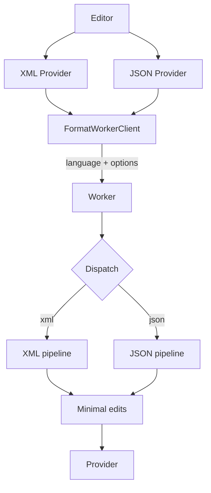

# Large File Formatter

Fast, safe, token-based formatter for very large **XML** and **JSON** files in VS Code & Cursor.

A formatter built to handle huge XML and JSON documents without blocking the editor — with structural safety checks, minimal edits, worker-thread offloading and performance visibility.

---

## Unique features

- Worker-thread formatting for large files  
  Offloads formatting to a Node worker when a file exceeds a configurable byte threshold (per language) so VS Code stays responsive.

- Structural validation with automatic safe fallback  
  Re-tokenizes formatted output and compares a structural signature; if the structure changes, the extension preserves the original content to avoid corrupting XML or JSON.

- Token-aware tokenizer & formatter (XML and JSON)  
  XML: declarations, DOCTYPE, processing instructions, comments, CDATA, quoted attributes. JSON: objects, arrays, strings, numbers, literals — more robust than regex-based formatters.

- Minimal, offset-based edits  
  Computes the smallest replacement range and applies only that edit to reduce undo churn and preserve editor state (selections, cursors).

- Performance visibility  
  Optional info popups show duration, worker/fallback status, size/threshold, edit count and token count.

- Diagnostics and graceful error handling  
  Emits warnings for unterminated or invalid tokens; worker failures fall back to a safe main-thread pass.

---

## Our formatter vs normal formatters

|                          | Normal formatters                          | Large File Formatter                              |
| ------------------------ | ------------------------------------------ | ------------------------------------------------- |
| **Where it runs**        | Main thread (same as the editor)           | Worker thread for large files                     |
| **On huge files**        | Editor can freeze or time out              | Stays responsive; work runs off the main thread   |
| **Speed on large files** | Often slow or unusable (MB-sized XML/JSON) | Much lower formatting time for the same file size |

**Example (XML, ~20 MB file):**

```
File Size: 20.66 MB
Tokens: 3,200,003
Formatting Time: 5133 ms
Worker Thread: enabled
Memory Mode: large-file
```

That’s a format time that most built-in or main-thread formatters cannot match on files this size — and the editor stays usable while it runs. Try the same file with a normal formatter and compare.

---

## Commands

- `Large File Formatter: Format Current Document` — format the current XML or JSON document (also bound to the standard Format Document action).

---

## Settings

- `large-file-formatter.insertFinalNewline` (boolean, default: `true`)  
  Append a trailing newline when formatting XML or JSON.

- `large-file-formatter.workerThresholdBytes` (number, default: `131072`)  
  Minimum XML document size (bytes) before formatting is offloaded to a worker.

- `large-file-formatter.jsonWorkerThresholdBytes` (number, default: `131072`)  
  Minimum JSON document size (bytes) before formatting is offloaded to a worker.

- `large-file-formatter.showFormatTiming` (boolean, default: `true`)  
  Show a popup with formatting duration after each format.

- `large-file-formatter.showFormatDetails` (boolean, default: `true`)  
  Include worker/fallback/size/edits/token details in the timing popup.

---

## Why choose this formatter?

- Designed for very large XML and JSON files where main-thread formatters can freeze the editor.
- Prioritizes safety — structural validation plus automatic fallback prevents accidental corruption.
- Minimizes editor churn through minimal-range edits and provides visibility into performance and decisions.

---

## Quick start

1. Install and enable the extension in VS Code.
2. Open an XML or JSON file and run “Format Document” or use the extension commands.
3. Tune behavior under `Preferences → Settings → Large File Formatter`.

---

## Architecture (simplified)



---

## Known constraints

- XML: avoids aggressive reflow in mixed-content nodes to preserve semantics.
- For malformed XML or JSON, the formatter may fall back to the original input to guarantee safety.

---

## Contributing

GitIngest is open source and we welcome contributions.

- 🌟 **Star the repository** – Help others discover Large File Formatter
- 🐛 **Report bugs** – [Open an issue](https://github.com/ShreyPurohit/Large-File-Formatter/issues)
- 💡 **Suggest features** – Share ideas via [GitHub Discussions](https://github.com/ShreyPurohit/Large-File-Formatter/discussions) or issues
- 🔧 **Contribute code** – See **[CONTRIBUTING.md](CONTRIBUTING.md)** for development setup, code style, and how to submit pull requests

---

## 📜 License

This project is licensed under the **MIT License**. See the [LICENSE](LICENSE) file for complete details.
