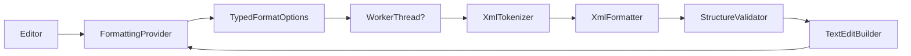

# Large File Formatter

Fast, safe, token-based XML formatter for very large files in VS Code & Cursor.

A formatter built to handle huge XML documents without blocking the editor — with structural safety checks, minimal edits, worker-thread offloading and quick benchmarking.

---

## Unique features

- Worker-thread formatting for large files  
  Offloads formatting to a Node worker when a file exceeds a configurable byte threshold so VS Code stays responsive.

- Structural validation with automatic safe fallback  
  Re-tokenizes formatted output and compares a structural signature; if the structure changes, the extension preserves the original content to avoid corrupting XML.

- Token-aware tokenizer & formatter  
  Correctly handles declarations, DOCTYPE (with nested internal subsets), processing instructions, comments, CDATA, and quoted attributes — more robust than regex-based formatters.

- Minimal, offset-based edits  
  Computes the smallest replacement range and applies only that edit to reduce undo churn and preserve editor state (selections, cursors).

- Performance visibility & benchmarking  
  Optional info popups show duration, worker/fallback status, size/threshold, edit count and token count. Includes a benchmark command for measuring throughput.

- Diagnostics and graceful error handling  
  Emits warnings for unterminated tokens; worker failures fall back to a safe main-thread pass.

---

## Commands

- `Large File Formatter: Format Current Document` — format the current XML document (also bound to the standard Format Document action).
- `Large File Formatter: Benchmark Current Document` — measure formatting speed and token count for the active XML file.

---

## Settings

- `large-file-formatter.insertFinalNewline` (boolean, default: `true`)  
  Append a trailing newline when formatting.

- `large-file-formatter.workerThresholdBytes` (number, default: `131072`)  
  Minimum document size (bytes) before formatting is offloaded to a worker.

- `large-file-formatter.showFormatTiming` (boolean, default: `true`)  
  Show a popup with formatting duration after each format.

- `large-file-formatter.showFormatDetails` (boolean, default: `true`)  
  Include worker/fallback/size/edits/token details in the timing popup.

---

## Why choose this formatter?

- Designed specifically for very large XML files where main-thread formatters can freeze the editor.
- Prioritizes safety — structural validation plus automatic fallback prevents accidental corruption.
- Minimizes editor churn through minimal-range edits and provides visibility into performance and decisions.

---

## Quick start

1. Install and enable the extension in VS Code.
2. Open an XML file and run “Format Document” or use the extension commands.
3. Tune behavior under `Preferences → Settings → Large File Formatter`.

---

## Architecture (simplified)

---

## Known constraints

- Avoids aggressive reflow in mixed-content nodes to preserve semantics.
- For malformed XML, the formatter may fall back to the original input to guarantee safety.

---

## Contributing

GitIngest is open source and we welcome contributions.

- 🌟 **Star the repository** – Help others discover XML Formatter
- 🐛 **Report bugs** – [Open an issue](https://github.com/ShreyPurohit/Large-XML-Formatter/issues)
- 💡 **Suggest features** – Share ideas via [GitHub Discussions](https://github.com/ShreyPurohit/Large-XML-Formatter/discussions) or issues
- 🔧 **Contribute code** – See **[CONTRIBUTING.md](CONTRIBUTING.md)** for development setup, code style, and how to submit pull requests

---

## 📜 License

This project is licensed under the **MIT License**. See the [LICENSE](LICENSE) file for complete details.
